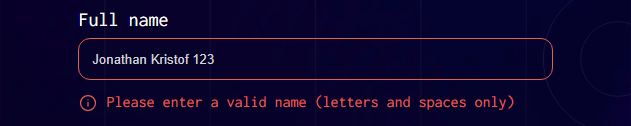
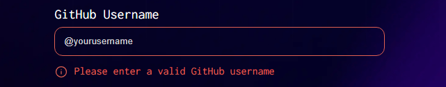
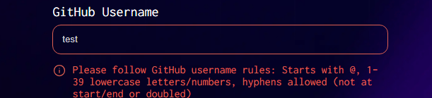

# Frontend Mentor - Conference ticket generator solution

This is a solution to the [Conference ticket generator challenge on Frontend Mentor](https://www.frontendmentor.io/challenges/conference-ticket-generator-oq5gFIU12w).

## Table of contents

- [Overview](#overview)
  - [The challenge](#the-challenge)
  - [Screenshots](#screenshots)
  - [Links](#links)
- [My process](#my-process)
  - [Built with](#built-with)
- [Author](#author)

## Overview

### The challenge

Users should be able to:

- Complete the form with their details
- Receive form validation messages if:
  - Any field is missed
  - The email address is not formatted correctly
  - The avatar upload is too big or the wrong image format
- Complete the form only using their keyboard
- Have inputs, form field hints, and error messages announced on their screen reader
- See the generated conference ticket when they successfully submit the form
- View the optimal layout for the interface depending on their device's screen size
- See hover and focus states for all interactive elements on the page

### Screenshots

- Filled form with user details:

- Form validation messages:

  1. **Upload avatar field**

  - Required

    

  - Invalid image type

    

  - Image bigger than 500KB

    

  2. **Full name field**

  - Required

    

  - Invalid

    

  3. **Email address field**

  - Required

    

  4. **GitHub username field**

  - Required

    

  - Invalid

    

- View the optimal layout for the interface depending on their device's screen size:

  1. Mobile layout

  

  

  2. Desktop layout

  

  

- See hover and focus states for all interactive elements on the page:

  1. Upload Avatar field

  

  2. Full name field

  

  3. Email field

  

  4. GitHub field

  

  5. Submit button

  

### Links

- Solution URL: [https://github.com/f29pereira/conference-ticket-generator](https://github.com/f29pereira/conference-ticket-generator)
- Live Site URL: [f29pereira.github.io/conference-ticket-generator/](f29pereira.github.io/conference-ticket-generator/)

## My process

### Built with

- Semantic HTML5 markup
- CSS custom properties
- Flexbox
- Mobile-first workflow
- TypeScript
- [React](https://reactjs.org/) - JS library
- [Next.js](https://nextjs.org/) - React framework

## Author

- Frontend Mentor - [@f29pereira](https://www.frontendmentor.io/profile/f29pereira)
